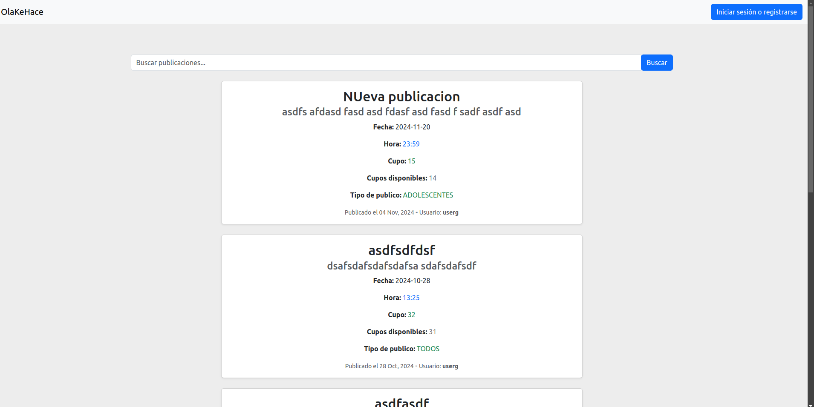

# Manual de Usuario - OlaKeHace
# 1. Home
## Pagina principar en la cual se podran visualizar las publicaciones

# 2. Registro
## 1. Ingresa tus datos 
## 2. Haz click en **Registrarse**
## 

# 3. Inicio de Sesión
## 1. Introduce tus credenciales.
## 
## 3. Haz clic en **Iniciar sesión**.

# 4. Home con sesion iniciada
## 1. Al inicar sesion se podra usar opciones como Agregar publicacio, mis publicaciones, Mis eventos y notificaciones, ademas de poder asistir o reportar una publicacion
## 

# 5. Mis publicaciones
## Podra visualizar las publicacioens creadas y ver el estado en el que se encuentra
##  

# 6. Mis eventos
## Podra visualizar los eventos y mostrar el tiempo restante o si ya fue finalizado
## 

# 7. Notificaciones
## Mostrara las notificaciones de cuando su publicacion fue aprobada, rechazada o baneada.
##  

# 8. Agregar publicacion
## 1. Ingresa los datos necesarios
## 2. Da click en Guardar
## 

# 9. Asistir 
## Al elegir una publicacion podras asistir a dicho evento.
##  

# 10.  Reportar
## Podra reportar una publicacion, por favor indicar el motivo, se baneara la publicacion hasta que un adminstrador lo decida. 
## 